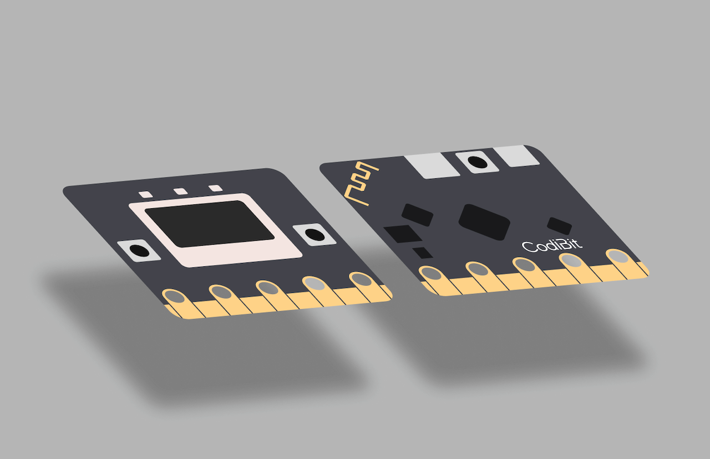
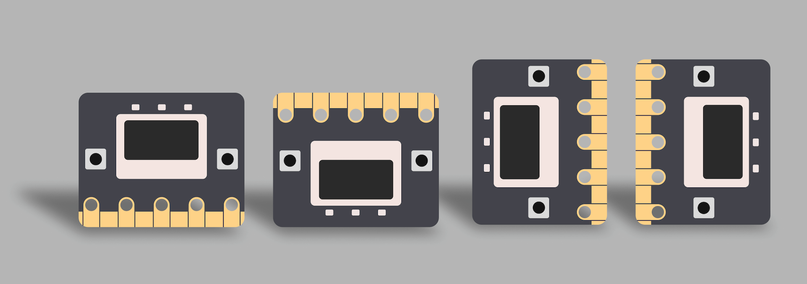

# Built-in Sensors

API for controlling built-in sensors on the Codi:bit board.

import TOCInline from '@theme/TOCInline';

**Table of Contents**
<TOCInline toc={toc} minHeadingLevel={2} maxHeadingLevel={2} />

## Utils

API for utility functions that work with built-in sensors.

### `get_board_temperature()`

Returns the current board temperature from the QMI8658 IMU sensor.

**Returns:**
- `int`: Current board temperature in Celsius (integer)
  Returns 25 if sensor error occurs

**Example:**
```python
temp = get_board_temperature()
print(f"Current board temperature: {temp}°C")
```

**Hardware Information:**
- **Sensor**: QMI8658 6-axis IMU (temperature sensor)
- **Interface**: I2C
- **Address**: 0x6B
- **Temperature Range**: -40°C to 85°C
- **Resolution**: 0.01°C
- **Accuracy**: ±1°C
- **Measurement Type**: Board temperature (not ambient temperature)

**Notes:**
1. **Board Temperature**: Measures the temperature of the board itself, not the surrounding environment
2. **Higher Values**: Board temperature is typically higher than ambient temperature due to component heat generation
3. **Error Handling**: Returns 25°C if sensor communication fails
4. **Range Validation**: Values outside -40°C to 85°C return 25°C
5. **Integer Return**: Returns integer value for memory efficiency
6. **Quiet Failure**: Fails silently with default value on hardware errors

## Buttons

API for controlling the built-in buttons on the Codi:bit board.

### Global Instances

```python
from codibit import button_a, button_b

button_a  # Button A
button_b  # Button B
```

### Methods

> **⚠️ Important: Performance and Responsiveness**
>
> When using button methods in `while` loops, always include appropriate time delays to ensure optimal performance and responsiveness:
>
> ```python
> # ✅ Recommended: Include time delays
> while True:
>     if button_a.is_pressed():
>         print("Button A pressed!")
>     time.sleep(0.01)  # 10ms delay for optimal performance
>
> # ❌ Avoid: No delays can cause performance issues
> while True:
>     if button_a.is_pressed():
>         print("Button A pressed!")
> ```
>
> **Recommended delays:**
> - `time.sleep(0.01)` - 10ms: Optimal for most applications
> - `time.sleep(0.05)` - 50ms: For stability-focused applications
> - `time.sleep(0.1)` - 100ms: For simple applications

#### `button.is_pressed()`

Detects the exact moment when a button is pressed (one-time event).

**Returns:**
- `bool`: `True` if the button was just pressed, `False` otherwise

**Example:**
```python
if button_a.is_pressed():
    print("Button A was pressed!")
```

#### `button.is_holding()`

Detects when a button is continuously being held down.

**Returns:**
- `bool`: `True` if the button is currently being held, `False` otherwise

**Example:**
```python
if button_a.is_holding():
    print("Button A is being held...")
```

#### `button.is_released()`

Detects the exact moment when a button is released (one-time event).

**Returns:**
- `bool`: `True` if the button was just released, `False` otherwise

**Example:**
```python
if button_a.is_released():
    print("Button A was released!")
```

#### `button.get_presses()`

Returns the total number of button presses since the last call to this method or since the device started, and resets the counter to zero.

**Returns:**
- `int`: Number of button presses

**Example:**
```python
presses = button_a.get_presses()
print(f"Button A was pressed {presses} times")
```

#### `button.get_press_count()`

Returns the total accumulated number of button presses without resetting the counter.

**Returns:**
- `int`: Total accumulated number of button presses

**Example:**
```python
total_presses = button_a.get_press_count()
print(f"Button A was pressed {total_presses} times total")
```

### Method Comparison

| Method | Function | Counter Reset | Use Case |
|--------|----------|---------------|----------|
| `is_pressed()` | Check current press state | - | Continuous actions (holding button) |
| `was_pressed()` | Event detection | - | Single events (menu selection) |
| `get_presses()` | Return press count and reset | ✅ | Periodic counting (check every 5 seconds) |
| `get_press_count()` | Check accumulated press count | ❌ | Real-time cumulative counting (total press tracking) |

### Hardware Information

- **Type**: Tactile push buttons
- **Pull-up Resistor**: 10KΩ (Hardware)
- **Active State**: LOW (pressed = 0V, released = 3.3V)
- **Debounce Time**: 50ms (Software)
- **Pin Assignment**: Button A (GPIO0), Button B (GPIO2)
- **Physical Location**: Front side of the board, labeled A and B

### Notes

1. **Debouncing**: Hardware button bouncing is handled automatically with 50ms debounce time
2. **Pull-up**: Built-in 10KΩ pull-up resistors ensure stable HIGH state when not pressed
3. **State Tracking**: `was_pressed()`, `get_presses()`, and `get_press_count()` methods automatically track button events
4. **Counter Management**: `get_presses()` resets the counter, while `get_press_count()` does not

## RGB LED

API for controlling the built-in RGB LED strip (3 LEDs).

### Global Instance

```python
from codibit import rgb_led

rgb_led  # Built-in RGB LED strip
```

### Methods

#### `rgb_led.set_color(strip_id, r, g, b)`

Sets the color of a specific LED strip.

**Parameters:**
- `strip_id` (int): LED strip number (0, 1, 2)
- `r` (int): Red value (0-255)
- `g` (int): Green value (0-255)
- `b` (int): Blue value (0-255)

**Example:**
```python
# Set strip 0 to red, strip 1 to green, strip 2 to blue
rgb_led.set_color(0, 255, 0, 0)    # Red
rgb_led.set_color(1, 0, 255, 0)    # Green
rgb_led.set_color(2, 0, 0, 255)    # Blue
```

#### `rgb_led.get_color(strip_id)`

Gets the current color of a specific LED strip.

**Parameters:**
- `strip_id` (int): LED strip number (0, 1, 2)

**Returns:**
- `tuple`: (r, g, b) color values

**Example:**
```python
# Get current color of strip 0
current_color = rgb_led.get_color(0)
print(f"Strip 0 color: {current_color}")  # Returns (r, g, b) tuple
```

#### `rgb_led.set_all_color(r, g, b)`

Sets all LED strips to the same color.

**Parameters:**
- `r` (int): Red value (0-255)
- `g` (int): Green value (0-255)
- `b` (int): Blue value (0-255)

**Example:**
```python
# Set all strips to white
rgb_led.set_all_color(255, 255, 255)

# Set all strips to red
rgb_led.set_all_color(255, 0, 0)
```

#### `rgb_led.set_brightness(strip_id, brightness)`

Sets the brightness of a specific LED strip while maintaining its current color.

**Parameters:**
- `strip_id` (int): LED strip number (0, 1, 2)
- `brightness` (float): Brightness (0.0-1.0)

**Example:**
```python
# Set strip 0 to red
rgb_led.set_color(0, 255, 0, 0)
# Set brightness to 50%
rgb_led.set_brightness(0, 0.5)
rgb_led.show()
```

#### `rgb_led.set_all_brightness(brightness)`

Sets the brightness of all LED strips while maintaining their current colors.

**Parameters:**
- `brightness` (float): Brightness (0.0-1.0)

**Example:**
```python
# Set different colors for each strip
rgb_led.set_color(0, 255, 0, 0)    # Red
rgb_led.set_color(1, 0, 255, 0)    # Green
rgb_led.set_color(2, 0, 0, 255)    # Blue
# Set all to 50% brightness
rgb_led.set_all_brightness(0.5)
rgb_led.show()
```

#### `rgb_led.turn_off(strip_id)`

Turns off a specific LED strip.

**Parameters:**
- `strip_id` (int): LED strip number (0, 1, 2)

**Example:**
```python
# Turn off strip 1
rgb_led.turn_off(1)
rgb_led.show()
```

#### `rgb_led.turn_off_all()`

Turns off all LED strips.

**Example:**
```python
# Turn off all strips
rgb_led.turn_off_all()
```

### Hardware Information

- **Type**: WS2812B RGB LED strip
- **Number of LEDs**: 3 LEDs in series
- **Pin Assignment**: GPIO17
- **Power Supply**: 3.3V
- **Data Protocol**: WS2812B protocol
- **Color Depth**: 24-bit (8-bit per color)
- **Brightness Control**: PWM-based brightness control

### Notes

1. **Color Range**: Each color component (R, G, B) ranges from 0-255
2. **Brightness Control**: Brightness is applied to all color components proportionally
3. **Power Efficiency**: Lower brightness reduces power consumption
4. **Automatic Update**: Colors are automatically applied when set
5. **Strip Numbering**: Strips are numbered 0, 1, 2 from left to right
6. **Color Mixing**: RGB values are mixed to create various colors

## Buzzer

API for controlling the built-in buzzer on the Codi:bit board.

### Global Instance

```python
from codibit import buzzer

buzzer  # Built-in buzzer
```

### Musical Notation

Musical notes are expressed in the format `NOTE[octave][:duration]`.

**Note Format:**
```python
'c4:4'    # C4 note for 4 ticks
'g'        # G4 note for default duration (4 ticks)
'r:2'      # Rest for 2 ticks
'eb:8'     # E♭4 note for 8 ticks
'f#5:1'    # F#5 note for 1 tick
```

**Supported Notes:**
- Basic notes: `c`, `d`, `e`, `f`, `g`, `a`, `b`
- Flats: `cb`, `db`, `eb`, `fb`, `gb`, `ab`, `bb`
- Sharps: `c#`, `d#`, `e#`, `f#`, `g#`, `a#`, `b#`
- Octaves: 3, 4(default), 5
- Rest: `r` (silence)

**Tempo System:**
- Default: 4 ticks, 120 BPM
- 1 tick = 60000 / BPM / ticks_per_beat milliseconds
- Default: 1 tick = 125ms, 1 beat = 500ms

#### `Sound`

Sound type constants for practical sounds and drum sounds.

**Practical Sounds:**
- `Sound.BEEP`
- `Sound.CHIME`
- `Sound.ALERT`
- `Sound.NOTIFICATION`
- `Sound.SUCCESS`
- `Sound.ERROR`
- `Sound.CLICK`
- `Sound.TICK`

**Drum Sounds:**
- `Sound.DRUM_KICK`
- `Sound.DRUM_SNARE`
- `Sound.DRUM_HIHAT`
- `Sound.DRUM_TOM1`
- `Sound.DRUM_TOM2`
- `Sound.DRUM_TOM3`
- `Sound.DRUM_FLOOR_TOM`
- `Sound.DRUM_CRASH`
- `Sound.DRUM_RIDE`
- `Sound.DRUM_HIHAT_OPEN`
- `Sound.DRUM_HIHAT_CLOSED`
- `Sound.DRUM_CHINA`
- `Sound.DRUM_SPLASH`
- `Sound.DRUM_COWBELL`
- `Sound.DRUM_CLAP`
- `Sound.DRUM_SHAKER`

#### `Melody`

Built-in melody definitions.

```python
from codibit import Melody

Melody.HAPPY_BIRTHDAY  # Happy Birthday song
Melody.TWINKLE_TWINKLE # Twinkle Twinkle Little Star
Melody.MARY_HAD_A_LITTLE_LAMB  # Mary Had a Little Lamb
```

### Methods

#### `buzzer.play_tone(frequency, duration_ms=1000)`

Plays a tone with the specified frequency. The tone automatically stops after the specified duration.

**Parameters:**
- `frequency` (int): Frequency in Hz
- `duration_ms` (int): Duration in milliseconds (default: 1000)

**Example:**
```python
buzzer.play_tone(440, 1000)      # Play 440Hz for 1 second (auto-stops)
buzzer.play_tone(262, 500)       # Play C4 note for 0.5 seconds (auto-stops)
```


#### `buzzer.play_melody(melody, tempo=None)`

Plays a melody using note strings.

**Parameters:**
- `melody` (list): List of note strings (e.g., ['c4:4', 'd4:4', 'e4:8'])
- `tempo` (int, optional): Tempo in BPM, uses default if None

**Built-in Melodies:**
```python
from codibit import Melody

# Available built-in melodies
Melody.HAPPY_BIRTHDAY
Melody.TWINKLE_TWINKLE
Melody.MARY_HAD_A_LITTLE_LAMB
```

**Example:**
```python
# Custom melody
buzzer.play_melody(['c4:4', 'd4:4', 'e4:4', 'f4:4', 'g4:8'], tempo=120)

# Built-in melody
from codibit import Melody
buzzer.play_melody(Melody.HAPPY_BIRTHDAY, tempo=200)
```

#### `buzzer.play_sound(sound_type)`

Plays a predefined sound.

**Parameters:**
- `sound_type` (str | Sound): Sound type from Sound class constants

**Example:**
```python
buzzer.play_sound(Sound.BEEP)
buzzer.play_sound(Sound.DRUM_KICK)
```

#### `buzzer.stop()`

Stops the current sound.

**Example:**
```python
buzzer.play_tone(440, 5000)  # Play for 5 seconds
buzzer.stop()  # Stop immediately
```

#### `buzzer.set_tempo(ticks=4, bpm=120)`

Sets the tempo.

**Parameters:**
- `ticks` (int): Ticks per beat (default: 4)
- `bpm` (int): Beats per minute (default: 120)

**Example:**
```python
buzzer.set_tempo(bpm=180)  # Set to fast tempo
buzzer.play_melody(['c4:4', 'd4:4', 'e4:4', 'f4:4', 'g4:8'])
```

#### `buzzer.get_tempo()`

Returns the current tempo.

**Returns:**
- `tuple`: (ticks, bpm)

**Example:**
```python
ticks, bpm = buzzer.get_tempo()
print(f"Current tempo: {bpm} BPM, {ticks} ticks")
```

#### `buzzer.set_volume(volume)`

Sets the buzzer volume.

**Parameters:**
- `volume` (int): Volume level (0-3)
  - `0`: Mute
  - `1`: Low
  - `2`: Medium (default)
  - `3`: High

**Example:**
```python
buzzer.set_volume(3)  # Set to high volume
buzzer.play_tone(440, 1000)
```

### Hardware Information

- **Type**: Piezoelectric buzzer
- **Pin Assignment**: GPIO16
- **PWM Frequency Range**: 20Hz - 20kHz
- **Volume Control**: PWM duty cycle (0-900)
- **Power Supply**: 3.3V
- **Physical Location**: Front side of the board

### Notes

1. **Volume Control**: Volume is controlled by PWM duty cycle, with maximum duty cycle of 900
2. **Interruptible**: All melody and song playback can be interrupted with Ctrl+C
3. **Tempo Control**: Tempo is specified in BPM (Beats Per Minute)
4. **Musical Notation**: Use `NOTE[octave][:duration]` format for musical notes
5. **Sound Types**: 8 practical sounds and 16 drum sounds available
6. **Drum Sounds**: Provides 16 different drum sounds
7. **Tick System**: The basic time unit for music is ticks, which length is determined by tempo

## Microphone

API for controlling the built-in microphone sensor.

### Global Instance

```python
from codibit import microphone

microphone  # Built-in microphone sensor
```

### Methods

#### `microphone.read()`

Returns the raw ADC value from the microphone sensor.

**Returns:**
- `int`: Raw ADC value (0-4095)

**Example:**
```python
value = microphone.read()
print(f"Raw value: {value}")
```

#### `microphone.get_level()`

Returns the sound level as a normalized value.

**Returns:**
- `int`: Sound level from 0 to 9, where:
  - 0: Very quiet
  - 1-2: Quiet
  - 3-4: Moderate
  - 5-6: Loud
  - 7-8: Very loud
  - 9: Extremely loud

**Example:**
```python
level = microphone.get_level()
print(f"Sound level: {level}")
```

#### `microphone.is_sound_detected()`

Checks if any sound is detected.

**Returns:**
- `bool`: `True` if sound is detected, `False` otherwise

**Example:**
```python
if microphone.is_sound_detected():
    print("Sound detected!")
```

#### `microphone.is_loud()`

Checks if the sound level is considered loud.

**Returns:**
- `bool`: `True` if sound level is 7 or higher, `False` otherwise

**Example:**
```python
if microphone.is_loud():
    print("It's too loud!")
```

#### `microphone.is_quiet()`

Checks if the sound level is considered quiet.

**Returns:**
- `bool`: `True` if sound level is 2 or lower, `False` otherwise

**Example:**
```python
if microphone.is_quiet():
    print("It's very quiet.")
```

### Hardware Information

- **Sensor**: Built-in microphone
- **Measurement Range**: 0-4095 (12-bit ADC)
- **Level Conversion**: 0-4095 → 0-9 (10 levels)
- **Auto-calibration**: Automatically calibrates to ambient noise
- **Response Time**: < 1ms

### Notes

1. **Auto-calibration**: The sensor automatically calibrates to the ambient environment
2. **Sound Detection**: Most sensitive to sudden changes in sound level
3. **Thresholds**: Loud sounds typically register as level 7 or higher
4. **Environment**: Works best in relatively quiet environments

## Light Sensor

API for controlling the ambient light sensor (ALS-PT19).

### Global Instance

```python
from codibit import light

light
```

### Methods

#### `light.read()`

Reads the raw light sensor value.

**Returns:**
- `int`: Light value (0-4095)

**Example:**
```python
value = light.read()
```

#### `light.read_level()`

Reads the light level.

**Returns:**
- `int`: Light level (0-9)

**Levels:**
- 0: Very dark
- 1-2: Dark
- 3-6: Normal
- 7-8: Bright
- 9: Very bright

**Example:**
```python
level = light.read_level()
```

### Hardware Information

- **Sensor**: ALS-PT19 ambient light sensor
- **Measurement Range**: 0-4095 (12-bit ADC)
- **Level Conversion**: 0-4095 → 0-9 (10 levels)
- **Response Time**: < 1ms
- **Power Consumption**: Very low

### Notes

1. **Environmental Factors**: Values may vary depending on ambient lighting
2. **Reflection**: Reflective objects near the sensor may affect measurements
3. **Temperature**: Accuracy may decrease at extreme temperatures
4. **Initialization**: Sensor automatically initializes when board is powered on

## Display

API for controlling the built-in SH1106 OLED display (128x64 pixels). Uses a buffer-based approach where drawing commands are stored in a buffer and then output to the screen using the `show()` function.

### Operation Mode

OLED displays consist of a memory buffer (128×64 pixel data) and the actual screen. `draw_` functions only store pixel data in the buffer, and the `show()` function transfers the entire buffer to the screen. `show_` functions internally call `show()` each time, updating the screen every time. Using `show_` functions in infinite loops causes the screen to flicker multiple times, so using `draw_` functions and then calling `show()` once provides smooth display.

> 💡 **For detailed principles, see [How to use display](../how-to/display-usage.md#technical-background), and for function comparison and usage patterns, see [Understanding draw_ vs show_ Functions](../how-to/display-usage.md#understanding-draw_-vs-show_-functions).**

### Usage Pattern

```python
# 1. Clear screen
display.clear()

# 2. Perform multiple drawing operations
display.draw_text("Hello", 0, 0)
display.draw_circle(32, 32, 10)
display.draw_rectangle(10, 10, 20, 15)

# 3. Output to screen
display.show()
```

### Global Instance

```python
from codibit import display

display
```

### Basic Control Methods

#### `display.clear()`

Clears only the buffer without outputting to display. Useful for performance optimization before multiple drawing operations.

**Example:**
```python
# Performance optimization usage
display.clear()  # Clear buffer only
display.draw_text("Hello", 0, 0)
display.draw_circle(32, 32, 10)
display.show()  # Output once at the end
```

#### `display.clear_immediate()`

Clears the screen and immediately outputs to display. Sets all pixels to 0 (off).

**Example:**
```python
display.clear_immediate()  # Clear screen immediately
```

#### `display.show()`

Outputs the buffer contents to the screen. Must be called after drawing operations to display on screen.

**Example:**
```python
display.draw_text("Hello", 0, 0)
display.draw_circle(32, 32, 10)
display.show()  # Output to screen
```

### Pixel Control

#### `display.get_pixel(x, y)`

Returns the pixel state at the specified coordinates.

**Parameters:**
- `x` (int): X coordinate (0-127)
- `y` (int): Y coordinate (0-63)

**Returns:**
- `int`: Pixel state (0 or 1)

**Example:**
```python
pixel_state = display.get_pixel(10, 20)
print(f"Pixel state: {pixel_state}")
```

#### `display.set_pixel(x, y, val)`

Sets the pixel state at the specified coordinates.

**Parameters:**
- `x` (int): X coordinate (0-127)
- `y` (int): Y coordinate (0-63)
- `val` (int): Pixel state (0 or 1)

**Example:**
```python
display.set_pixel(10, 20, 1)  # Turn on pixel
display.show()
```

### Drawing Methods (draw_ functions)

#### `display.draw_text(text, x, y)`

Draws text at the specified position. Only draws to buffer, requires separate `show()` call to display on screen.

**Parameters:**
- `text` (str): Text to draw
- `x` (int): X coordinate
- `y` (int): Y coordinate

**Example:**
```python
display.draw_text("Hello", 0, 0)
display.draw_text("World", 0, 10)
display.show()
```

#### `display.draw_rectangle(x, y, w, h, fill=False)`

Draws a rectangle. Only draws to buffer, requires separate `show()` call to display on screen.

**Parameters:**
- `x` (int): X coordinate of top-left corner
- `y` (int): Y coordinate of top-left corner
- `w` (int): Width
- `h` (int): Height
- `fill` (bool): Whether to fill (default: False)

**Example:**
```python
# Empty rectangle
display.draw_rectangle(10, 10, 20, 15)
# Filled rectangle
display.draw_rectangle(40, 10, 20, 15, fill=True)
display.show()
```

#### `display.draw_line(x1, y1, x2, y2)`

Draws a line between two points. Only draws to buffer, requires separate `show()` call to display on screen.

**Parameters:**
- `x1` (int): X coordinate of start point
- `y1` (int): Y coordinate of start point
- `x2` (int): X coordinate of end point
- `y2` (int): Y coordinate of end point

**Example:**
```python
display.draw_line(0, 0, 50, 50)
display.draw_line(0, 50, 50, 0)
display.show()
```

#### `display.draw_circle(x, y, r, fill=False)`

Draws a circle. Only draws to buffer, requires separate `show()` call to display on screen.

**Parameters:**
- `x` (int): X coordinate of center
- `y` (int): Y coordinate of center
- `r` (int): Radius
- `fill` (bool): Whether to fill (default: False)

**Example:**
```python
# Empty circle
display.draw_circle(32, 32, 10)
# Filled circle
display.draw_circle(64, 32, 8, fill=True)
display.show()
```

#### `display.draw_triangle(x1, y1, x2, y2, x3, y3, fill=False)`

Draws a triangle. Only draws to buffer, requires separate `show()` call to display on screen.

**Parameters:**
- `x1, y1` (int): Coordinates of first vertex
- `x2, y2` (int): Coordinates of second vertex
- `x3, y3` (int): Coordinates of third vertex
- `fill` (bool): Whether to fill (default: False)

**Example:**
```python
# Empty triangle
display.draw_triangle(10, 10, 20, 40, 40, 40)
# Filled triangle
display.draw_triangle(50, 10, 60, 40, 80, 40, fill=True)
display.show()
```

#### `display.draw_image(image, x, y, scale=1)`

Draws an image at the specified position. Only draws to buffer, requires separate `show()` call to display on screen.

**Parameters:**
- `image`: Image object
- `x` (int): Starting X coordinate
- `y` (int): Starting Y coordinate
- `scale` (int): Scale size (1=original size, 2=2x, 3=3x), default: 1

**Example:**
```python
from codibit import Image

# Draw built-in images (original size)
display.draw_image(Image.HEART, 0, 0)
display.draw_image(Image.HAPPY, 20, 0)

# Draw images with scaling
display.draw_image(Image.HEART, 0, 20, scale=2)  # 2x size
display.draw_image(Image.HAPPY, 40, 20, scale=3)  # 3x size
display.show()
```

### Immediate Display Methods (show_ functions)

#### `display.show_text(text, x, y)`

Draws text and immediately displays it on screen.

**Parameters:**
- `text` (str): Text to draw
- `x` (int): X coordinate
- `y` (int): Y coordinate

**Example:**
```python
display.show_text("Hello", 0, 0)  # Immediate display
display.show_text("World", 0, 10)  # Immediate display
```

#### `display.show_rectangle(x, y, w, h, fill=False)`

Draws a rectangle and immediately displays it on screen.

**Parameters:**
- `x` (int): X coordinate of top-left corner
- `y` (int): Y coordinate of top-left corner
- `w` (int): Width
- `h` (int): Height
- `fill` (bool): Whether to fill (default: False)

**Example:**
```python
# Empty rectangle immediate display
display.show_rectangle(10, 10, 20, 15)
# Filled rectangle immediate display
display.show_rectangle(40, 10, 20, 15, fill=True)
```

#### `display.show_line(x1, y1, x2, y2)`

Draws a line and immediately displays it on screen.

**Parameters:**
- `x1` (int): X coordinate of start point
- `y1` (int): Y coordinate of start point
- `x2` (int): X coordinate of end point
- `y2` (int): Y coordinate of end point

**Example:**
```python
display.show_line(0, 0, 50, 50)  # Immediate display
display.show_line(0, 50, 50, 0)  # Immediate display
```

#### `display.show_circle(x, y, r, fill=False)`

Draws a circle and immediately displays it on screen.

**Parameters:**
- `x` (int): X coordinate of center
- `y` (int): Y coordinate of center
- `r` (int): Radius
- `fill` (bool): Whether to fill (default: False)

**Example:**
```python
# Empty circle immediate display
display.show_circle(32, 32, 10)
# Filled circle immediate display
display.show_circle(64, 32, 8, fill=True)
```

#### `display.show_triangle(x1, y1, x2, y2, x3, y3, fill=False)`

Draws a triangle and immediately displays it on screen.

**Parameters:**
- `x1, y1` (int): Coordinates of first vertex
- `x2, y2` (int): Coordinates of second vertex
- `x3, y3` (int): Coordinates of third vertex
- `fill` (bool): Whether to fill (default: False)

**Example:**
```python
# Empty triangle immediate display
display.show_triangle(10, 10, 20, 40, 40, 40)
# Filled triangle immediate display
display.show_triangle(50, 10, 60, 40, 80, 40, fill=True)
```

#### `display.show_image(image, x, y, scale=1)`

Draws an image and immediately displays it on screen.

**Parameters:**
- `image`: Image object
- `x` (int): Starting X coordinate
- `y` (int): Starting Y coordinate
- `scale` (int): Scale size (1=original size, 2=2x, 3=3x), default: 1

**Example:**
```python
from codibit import Image

# Built-in image immediate display
display.show_image(Image.HEART, 0, 0)
display.show_image(Image.HAPPY, 20, 0, scale=2)
```

### Hardware Information

- **Display**: SH1106 OLED
- **Resolution**: 128x64 pixels
- **Color**: Monochrome (white/black)
- **Interface**: I2C
- **Address**: 0x3C
- **Rotation**: 180 degrees (screen displays in correct orientation)
- **Power Supply**: 3.3V
- **Physical Location**: Front side of the board

### Notes

1. **Pixel Coordinates**: Origin (0,0) is at top-left corner
2. **Pixel Values**: Only 0 (off) or 1 (on) are supported
3. **Buffer Output**: `draw_` functions only draw to buffer, requires separate `show()` call to display on screen
4. **Immediate Display**: `show_` functions draw and immediately display on screen
5. **Built-in Images**: 64 different images available (see Image section)
6. **Scaling**: Images can be scaled for better visibility when displayed
7. **Performance**: It's efficient to process multiple drawing operations at once before calling `show()`
8. **Buffer Control**: `clear()` only clears the buffer, while `clear_immediate()` outputs immediately for performance optimization
9. **Infinite Loops**: Use `draw_` functions in animations or games and call `show()` only once at the end
10. **Static Screens**: Use `show_` functions for screens displayed only once to keep code concise

## Image

API for creating and manipulating images for the display.

### Usage

```python
from codibit import Image
```

### Creating Images

#### `Image(width, height)`

Creates an empty image with the specified dimensions.

**Parameters:**
- `width` (int): Image width
- `height` (int): Image height

**Example:**
```python
img = Image(5, 5)  # Create 5x5 empty image
```

#### `Image(string)`

Creates an image from a string representation.

**Parameters:**
- `string` (str): Image string in format "row1:row2:row3:..."

**Example:**
```python
heart = Image('01010:11111:11111:01110:00100:')
```

### Methods

#### `image.set_pixel(x, y, value)`

Sets the pixel state in the image.

**Parameters:**
- `x` (int): X coordinate
- `y` (int): Y coordinate
- `value` (int): Pixel state (0 or 1)

**Example:**
```python
img = Image(5, 5)
img.set_pixel(2, 2, 1)  # Turn on center pixel
```

#### `image.get_pixel(x, y)`

Returns the pixel state in the image.

**Parameters:**
- `x` (int): X coordinate
- `y` (int): Y coordinate

**Returns:**
- `int`: Pixel state (0 or 1)

**Example:**
```python
pixel_state = img.get_pixel(2, 2)
```

#### `image.width()`

Returns the width of the image.

**Returns:**
- `int`: Image width

**Example:**
```python
width = img.width()
```

#### `image.height()`

Returns the height of the image.

**Returns:**
- `int`: Image height

**Example:**
```python
height = img.height()
```

#### `image.shift_left(n)`

Shifts the image left by n pixels.

**Parameters:**
- `n` (int): Number of pixels to shift

**Returns:**
- `Image`: New shifted image

**Example:**
```python
shifted = img.shift_left(1)
```

#### `image.shift_right(n)`

Shifts the image right by n pixels.

**Parameters:**
- `n` (int): Number of pixels to shift

**Returns:**
- `Image`: New shifted image

**Example:**
```python
shifted = img.shift_right(1)
```

#### `image.shift_up(n)`

Shifts the image up by n pixels.

**Parameters:**
- `n` (int): Number of pixels to shift

**Returns:**
- `Image`: New shifted image

**Example:**
```python
shifted = img.shift_up(1)
```

#### `image.shift_down(n)`

Shifts the image down by n pixels.

**Parameters:**
- `n` (int): Number of pixels to shift

**Returns:**
- `Image`: New shifted image

**Example:**
```python
shifted = img.shift_down(1)
```

import ImagePreview from '@site/src/components/ImagePreview';
import { IMAGE_STRINGS } from '@site/src/constants/imageStrings';

### Built-in Images

The Image class provides 64 built-in images that can be used with the display. For a complete reference with visual previews, see [Built-in Images](./builtin-images.md).

#### Example Images

| Image | Preview | Image | Preview | Image | Preview |
|------|---------|------|---------|------|---------|
| `Image.HEART` | <ImagePreview imageString={IMAGE_STRINGS.HEART} /> | `Image.HAPPY` | <ImagePreview imageString={IMAGE_STRINGS.HAPPY} /> | `Image.STAR` | <ImagePreview imageString={IMAGE_STRINGS.STAR} /> |
| `Image.SAD` | <ImagePreview imageString={IMAGE_STRINGS.SAD} /> | `Image.DIAMOND` | <ImagePreview imageString={IMAGE_STRINGS.DIAMOND} /> | `Image.RABBIT` | <ImagePreview imageString={IMAGE_STRINGS.RABBIT} /> |

#### Image Categories

- **Basic Images**: HEART, HAPPY, SAD, STAR, CONFUSED, ANGRY, SURPRISED, etc.
- **Geometric Shapes**: TRIANGLE, DIAMOND, SQUARE, CHESSBOARD, etc.
- **Animals & Characters**: RABBIT, COW, DUCK, GHOST, GIRAFFE, etc.
- **Tools & Objects**: SWORD, UMBRELLA, HOUSE, TARGET, etc.
- **Music**: MUSIC_CROTCHET, MUSIC_QUAVER, PITCHFORK, etc.
- **Clock Faces**: CLOCK1 through CLOCK12 for time animations
- **Arrows**: 8-directional arrows (N, NE, E, SE, S, SW, W, NW)

**📖 See [Built-in Images](./builtin-images.md) for the complete reference with all 64 images and visual previews.**

### Usage with Display

Images are designed to work seamlessly with the display:

**Example:**
```python
from codibit import display, Image

# Draw built-in images
display.draw_image(Image.HEART, 0, 0)
display.draw_image(Image.HAPPY, 20, 0)
display.show()

# Create and draw custom image
custom = Image('10001:01010:00100:01010:10001:')
display.draw_image(custom, 0, 20)
display.show()

# Image scaling
display.draw_image(Image.HEART, 0, 0, scale=2)
display.draw_image(Image.HAPPY, 40, 0, scale=3)
display.show()
```

### Image Lists

The Image class provides convenient image lists for animations and repetitive tasks:

#### `Image.ALL_CLOCKS`

A list of 12 clock images for clock animations.

**Example:**
```python
# Clock hand rotation animation
for clock in Image.ALL_CLOCKS:
    display.clear()
    display.draw_image(clock, 0, 0)
    display.show()
    time.sleep(0.1)
```

#### `Image.ALL_ARROWS`

A list of 8-directional arrow images. Useful for rotating arrow animations.

**Example:**
```python
# Rotating arrow animation
for arrow in Image.ALL_ARROWS:
    display.clear()
    display.draw_image(arrow, 0, 0)
    display.show()
    time.sleep(0.2)

# Random arrow selection
import random
random_arrow = random.choice(Image.ALL_ARROWS)
display.draw_image(random_arrow, 0, 0, scale=2)
```

### Notes

1. **String Format**: Images can be created from strings using ':' to separate rows
2. **Pixel State**: 0-1 scale (0=off, 1=on)
3. **Built-in Images**: 64 different images available for immediate use
4. **Display Integration**: Images can be drawn to the display using the `draw_image()` method
5. **Scaling**: Images can be scaled for better visibility using the `draw_image()` method with scale parameter
6. **Buffer-based**: Image drawing also works with the buffer-based approach, requiring `show()` calls

## Accelerometer

API for controlling the built-in QMI8658 accelerometer sensor.

### Global Instance

```python
from codibit import accelerometer

accelerometer
```

### Methods

#### `accelerometer.get_x()`

Returns the acceleration value on the X-axis.

**Returns:**
- `int`: X-axis acceleration value

**Example:**
```python
x_value = accelerometer.get_x()
print(f"X-axis acceleration: {x_value}")
```

#### `accelerometer.get_y()`

Returns the acceleration value on the Y-axis.

**Returns:**
- `int`: Y-axis acceleration value

**Example:**
```python
y_value = accelerometer.get_y()
print(f"Y-axis acceleration: {y_value}")
```

#### `accelerometer.get_z()`

Returns the acceleration value on the Z-axis.

**Returns:**
- `int`: Z-axis acceleration value

**Example:**
```python
z_value = accelerometer.get_z()
print(f"Z-axis acceleration: {z_value}")
```

#### `accelerometer.get_values()`

Returns a tuple of acceleration values for all three axes.

**Returns:**
- `tuple`: (x, y, z) acceleration values

**Example:**
```python
x, y, z = accelerometer.get_values()
print(f"Acceleration: X={x}, Y={y}, Z={z}")
```

#### `accelerometer.get_strength()`

Returns the magnitude of acceleration (total acceleration strength).

**Returns:**
- `int`: Acceleration magnitude

**Example:**
```python
strength = accelerometer.get_strength()
print(f"Acceleration strength: {strength}")
```

#### `accelerometer.get_gesture()`

Returns the current gesture state of the board.

**Returns:**
- `str`: Current gesture state
  - `"FREE_FALL"`: Board is in free fall
  - `"SHAKE"`: Board is being shaken
  - `"FACE_UP"`: Board is flat with screen facing up
  - `"FACE_DOWN"`: Board is flat with screen facing down
  - `"UP"`: Board is standing vertically (screen facing forward)
  - `"DOWN"`: Board is standing vertically (screen facing backward)
  - `"LEFT"`: Board is tilted to the left
  - `"RIGHT"`: Board is tilted to the right

##### Face Up and Face Down


##### Up, Down, Left, Right


**Example:**
```python
gesture = accelerometer.get_gesture()
print(f"Current gesture: {gesture}")
```

#### `accelerometer.is_gesture(name)`

Checks if the specified gesture is currently active.

**Parameters:**
- `name` (str): Gesture name to check

**Returns:**
- `bool`: `True` if the gesture is currently active, `False` otherwise

**Example:**
```python
if accelerometer.is_gesture("FACE_UP"):
    print("Board is face up")
```

#### `accelerometer.was_gesture(name)`

Checks if the specified gesture was activated since the last call to this method.

**Parameters:**
- `name` (str): Gesture name to check

**Returns:**
- `bool`: `True` if the gesture was activated, `False` otherwise

**Example:**
```python
if accelerometer.was_gesture("SHAKE"):
    print("Shake detected!")
```

### Hardware Information

- **Sensor**: QMI8658 6-axis IMU
- **Interface**: I2C
- **Address**: 0x6B
- **Measurement Range**: ±2g, ±4g, ±8g, ±16g
- **Resolution**: 16-bit
- **Update Rate**: Up to 200Hz
- **Power Supply**: 3.3V
- **Physical Location**: Integrated on the board

### Coordinate System

The Codi:bit board's accelerometer operates based on the board's actual physical orientation:

#### **Axis Directions**
- **X-axis**: Forward and backward tilt (Tilt forward and backward)
  - Positive when tilted forward, negative when tilted backward
- **Y-axis**: Left and right tilt (Tilt left and right)
  - Positive when tilted left, negative when tilted right
- **Z-axis**: Up and down flip (Flip up and down)
  - Approximately -1.0 when flat, approximately +1.0 when flipped

#### **Gravity Reference**
- When the board is placed flat, gravity acts in the -Z direction
- In stationary state, Z-axis is approximately -1.0 (opposite to gravity direction)
- When the board is flipped, Z-axis is approximately +1.0 (same as gravity direction)

#### **Measurement Range**
- **General range**: -2.0 ~ +2.0 (measures up to approximately 2 times gravity)
- **Stationary state**: -1.0 ~ +1.0 (gravity only)
- **Tilt detection**: Each axis measures gravity components decomposed according to tilt in that direction

### Notes

1. **Calibration**: The sensor automatically calibrates to gravity
2. **Gravity**: When stationary, the Z-axis typically shows ~1g (gravity)
3. **Movement Detection**: Use `get_strength()` to detect overall movement
4. **Axis Values**: Individual axis values can be positive or negative
5. **Sampling**: Values are updated at the sensor's configured rate
6. **Noise**: Small variations are normal due to sensor noise
7. **Gesture Detection**: Use `get_gesture()`, `is_gesture()`, and `was_gesture()` for advanced gesture recognition
8. **Gesture Priority**: SHAKE has highest priority, followed by FREE_FALL, then orientation gestures

## Magnetometer

API for controlling the Codi:bit magnetometer sensor. Uses the MMC5603 magnetometer sensor to measure 3-axis magnetic fields and provide compass functionality.

### Global Instance

```python
from codibit import magnetometer

magnetometer  # Built-in magnetometer sensor
```

### Basic Usage

```python
from codibit import *

# Calibrate magnetometer sensor (required before use)
print("Starting magnetometer calibration...")
print("Please hold the board in the air and slowly draw figure-8 patterns")
print("for about 20 seconds to calibrate the sensor...")
magnetometer.calibrate()
print("Calibration complete!")

# Read magnetic field values
x = magnetometer.get_x()
y = magnetometer.get_y()
z = magnetometer.get_z()

# Read compass heading
heading = magnetometer.get_heading()
```

### Methods

#### `magnetometer.calibrate()`

Calibrates the magnetometer sensor. For accurate measurements, hold the board in the air and slowly draw figure-8 patterns for about 20 seconds.

**Example:**
```python
print("Starting magnetometer calibration...")
print("Please hold the board in the air and slowly draw figure-8 patterns")
print("for about 20 seconds to calibrate the sensor...")
magnetometer.calibrate()
print("Calibration complete!")
```

#### `magnetometer.calibrate()`

Calibrates the magnetometer sensor. For accurate measurements, hold the board in the air and slowly draw figure-8 patterns for about 20 seconds.

**Example:**
```python
print("Starting magnetometer calibration...")
print("Please hold the board in the air and slowly draw figure-8 patterns")
print("for about 20 seconds to calibrate the sensor...")
magnetometer.calibrate()
print("Calibration complete!")
```

#### `magnetometer.get_x()`

Returns the magnetic field value on the X-axis.

**Returns:**
- `float`: X-axis magnetic field value

**Example:**
```python
x_value = magnetometer.get_x()
print(f"X-axis magnetic field: {x_value}")
```

#### `magnetometer.get_y()`

Returns the magnetic field value on the Y-axis.

**Returns:**
- `float`: Y-axis magnetic field value

**Example:**
```python
y_value = magnetometer.get_y()
print(f"Y-axis magnetic field: {y_value}")
```

#### `magnetometer.get_z()`

Returns the magnetic field value on the Z-axis.

**Returns:**
- `float`: Z-axis magnetic field value

**Example:**
```python
z_value = magnetometer.get_z()
print(f"Z-axis magnetic field: {z_value}")
```

#### `magnetometer.get_values()`

Returns a tuple of magnetic field values for all three axes.

**Returns:**
- `tuple`: (x, y, z) magnetic field values

**Example:**
```python
x, y, z = magnetometer.get_values()
print(f"Magnetic field: X={x}, Y={y}, Z={z}")
```

#### `magnetometer.get_strength()`

Returns the magnetic field strength.

**Returns:**
- `float`: Magnetic field strength

**Example:**
```python
strength = magnetometer.get_strength()
print(f"Magnetic field strength: {strength}")
```

#### `magnetometer.get_heading()`

Returns the compass heading. Provides the most accurate direction when the board is in a horizontal position.

**Returns:**
- `float`: Compass heading (0-360 degrees)

**Example:**
```python
heading = magnetometer.get_heading()
print(f"Compass heading: {heading} degrees")
```

### Hardware Information

- **Sensor**: MMC5603 magnetometer sensor
- **Interface**: I2C
- **Address**: 0x30
- **Measurement Range**: ±8 Gauss
- **Resolution**: 16-bit
- **Update Rate**: Up to 100Hz
- **Power Supply**: 3.3V
- **Physical Location**: Integrated on the board

### Coordinate System

The Codi:bit board's magnetometer operates based on the board's actual physical orientation:

#### **Axis Directions**
- **X-axis**: Left-right direction
  - Positive in left direction, negative in right direction
- **Y-axis**: Forward-backward direction
  - Positive in forward direction, negative in backward direction
- **Z-axis**: Up-down direction
  - Positive in upward direction, negative in downward direction

#### **Compass Directions**
- **0°**: North
- **90°**: East
- **180°**: South
- **270°**: West

#### **Measurement Range**
- **Magnetic field values**: -8.0 ~ +8.0 Gauss
- **Compass heading**: 0.0 ~ 360.0 degrees
- **Magnetic field strength**: 0.0 ~ +infinity

### Notes

1. **Calibration**: Call `calibrate()` before measurements for accurate readings
2. **Metal objects**: Nearby metal objects may affect measurements
3. **Electromagnetic fields**: Accuracy may decrease in environments with electromagnetic fields
4. **Level position**: Compass functionality is most accurate when the board is in a horizontal position
5. **Environmental factors**: Magnetic field values can vary greatly depending on the surrounding environment
6. **Calibration needed**: Calibration is recommended when first used or when the environment changes

## Gyroscope

API for controlling the built-in QMI8658 gyroscope sensor.

### Global Instance

```python
from codibit import gyroscope

gyroscope
```

### Methods

#### `gyroscope.get_x()`

Returns the angular velocity value on the X-axis.

**Returns:**
- `int`: X-axis angular velocity value

**Example:**
```python
x_value = gyroscope.get_x()
print(f"X-axis angular velocity: {x_value}")
```

#### `gyroscope.get_y()`

Returns the angular velocity value on the Y-axis.

**Returns:**
- `int`: Y-axis angular velocity value

**Example:**
```python
y_value = gyroscope.get_y()
print(f"Y-axis angular velocity: {y_value}")
```

#### `gyroscope.get_z()`

Returns the angular velocity value on the Z-axis.

**Returns:**
- `int`: Z-axis angular velocity value

**Example:**
```python
z_value = gyroscope.get_z()
print(f"Z-axis angular velocity: {z_value}")
```

#### `gyroscope.get_values()`

Returns a tuple of angular velocity values for all three axes.

**Returns:**
- `tuple`: (x, y, z) angular velocity values

**Example:**
```python
x, y, z = gyroscope.get_values()
print(f"Angular velocity: X={x}, Y={y}, Z={z}")
```

#### `gyroscope.get_strength()`

Returns the magnitude of angular velocity (total rotation strength).

**Returns:**
- `int`: Angular velocity magnitude

**Example:**
```python
strength = gyroscope.get_strength()
print(f"Angular velocity strength: {strength}")
```

### Hardware Information

- **Sensor**: QMI8658 6-axis IMU
- **Interface**: I2C
- **Address**: 0x6B
- **Measurement Range**: ±16, ±32, ±64, ±128, ±256, ±512, ±1024, ±2048 dps
- **Resolution**: 16-bit
- **Update Rate**: Up to 200Hz
- **Power Supply**: 3.3V
- **Physical Location**: Integrated on the board

### Coordinate System

The Codi:bit board's gyroscope operates based on the board's actual physical orientation:

#### **Axis Directions**
- **X-axis**: Roll (left-right rotation)
  - Positive when rotating left, negative when rotating right
- **Y-axis**: Pitch (forward-backward rotation)
  - Positive when rotating forward, negative when rotating backward
- **Z-axis**: Yaw (clockwise-counterclockwise rotation)
  - Positive when rotating clockwise, negative when rotating counterclockwise

#### **Measurement Range**
- **Angular velocity values**: Depends on configured range (±16 to ±2048 dps)
- **Rotation detection**: Measures rate of rotation around each axis
- **Stationary state**: Values close to 0 when not rotating

### Notes

1. **Calibration**: The sensor automatically calibrates to zero when stationary
2. **Rotation detection**: Use `get_strength()` to detect overall rotation
3. **Axis values**: Individual axis values can be positive or negative
4. **Sampling**: Values are updated at the sensor's configured rate
5. **Noise**: Small variations are normal due to sensor noise
6. **Range selection**: The sensor automatically selects appropriate measurement range